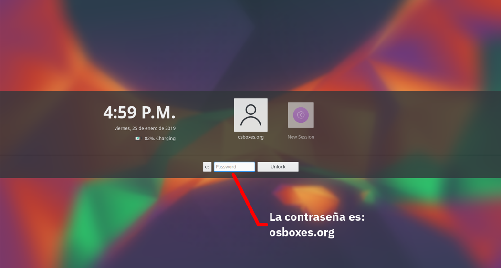
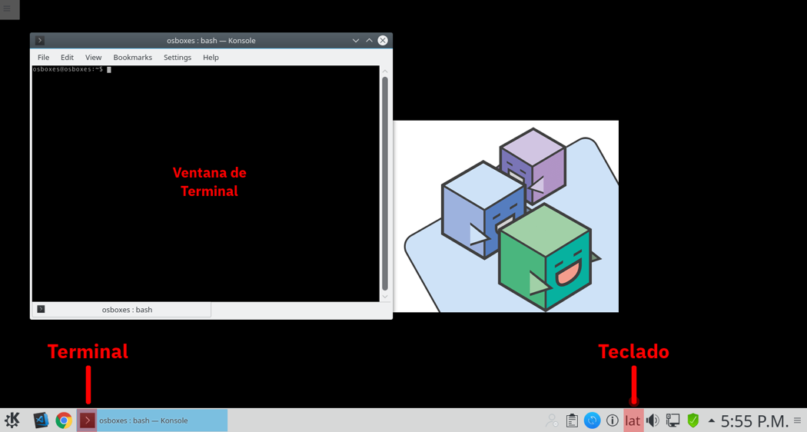

# Instrucciones para la creación del ambiente de trabajo
## Introducción
Siguiendo las siguientes instrucciones, se espera que el alumno obtenga la capacidad de inicializar el ambiente de desarrollo sobre el que se soportará el curso
## 1. Preparando el ambiente
Para la ejecución de este taller, se les ha proporcionado una maquina virtual previamente configurada con Linux y contiene un ambiente de desarrollo listo. Este ambiente de desarrollo contiene un entorno de Blockchain basado en Hyperledger Fabric y un entorno de desarrollo sencillo basado en Hyperledger Composer.

__Nota:__ Por favor revisen que tienen la máquina virtual instalada en su máquina y en caso de no encontrarla comentar con el profesor o el laboratorista

### 1.1 Iniciando la Máquina Virtual
Para entrar a la máquina virtual, nos firmamos como el usuario __osboxes.org__ con la contraseña __osboxes.org__

### 1.2 Preparando la Máquina
Una vez iniciada la máquina, debemos revisar que la distribución de teclado corresponda con la máquina que tenemos. Para estar listo, la maquina virtual cuenta con configuraciones para teclados en inglés, español y español latinoamericano. 
En nuestra pantalla tenemos botones en la parte inferior, localizar el botón de terminal y presionarlo para mostrar una terminal. Escribir unos cuantos caracteres especiales (acentos o ñ) para ver si el teclado está bien configurado. En caso contrario dar click sobre el botón de teclado para ciclar por las distintas opciones hasta encontrar la opción correcta

