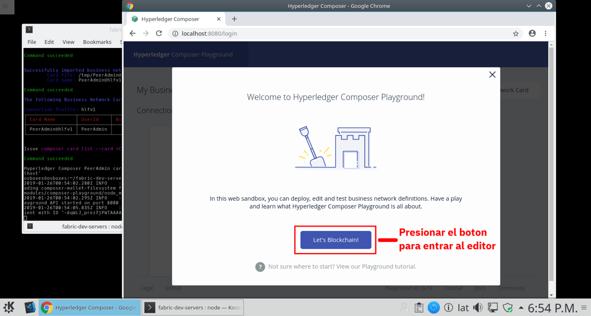
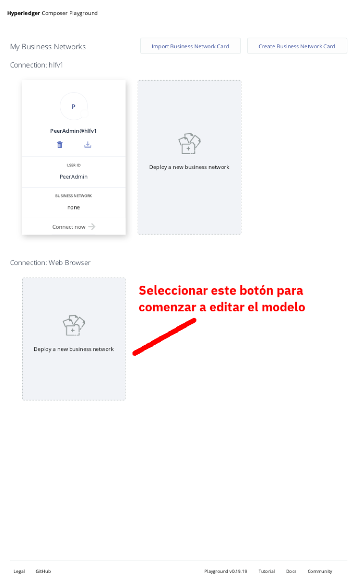
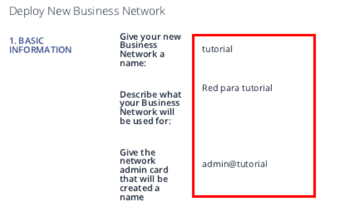
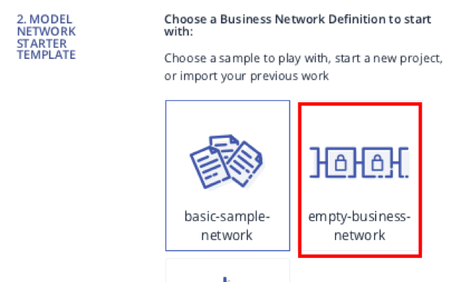
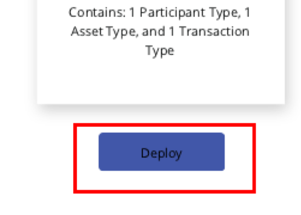

# Instrucciones para preparar el ambiente de Hyperledger Composer
## 1. Introducción
Siguiendo las siguientes instrucciones, se espera que el alumno pueda preparar un entorno de trabajo mediante Hyperledger Composer en donde se realizará la creación de la red de negocio
## 2. Creación del Ambiente
### 2.1 Inicializando el Composer Playground
Para iniciar nuestro entorno de desarrollo, debemos ejecutar el siguiente comando

```
composer-playground
```

En caso de ser exitosos, se abrirá una ventana de navegador, mostrando la interfaz de usuario de Hyperledger Composer, como se muestra en la siguiente imagen. Para entrar, presionar el botón de acceso marcado como “Lets Blockchain".



### 2.2 Selección del Modelo de Despliegue

Una vez inicializado, debemos elegir el modelo bajo el cual se hará tanto la edición como el despliegue del modelo. La herramienta nos muestra la capacidad de elegir un despliegue sobre blockchain o un despliegue sobre el navegador.

__Nota:__ Mientras nos encontramos desarrollando, conviene elegir el modo de navegador y reservar el modelo de blockchain para cuando tenemos un modelo ya elaborado.

Para crear un modelo en el navegador, debemos hacerlo seleccionando la opción inferior (es posible que debamos hacer scroll para verla) como se muestra a continuación



### 2.3 Especificando los Generales del Modelo

Una vez seleccionado el modo, debemos capturar los siguientes datos para configurar el modelo de red de negocio a editar. Iniciamos capturando los datos básicos de __Nombre__, __Descripción__ y __Nombre de Usuario del Administrador__



Acto seguido seleccionamos la opción para crear una red en blanco



Finalmente hacemos click en el botón para desplegar la red



### 2.4 Conectándonos a la Red
Una vez que la red ha sido creada, nos conectamos a ella en la nueva credencial creada para el administrador


[__Regresar al Inicio__](README.MD)