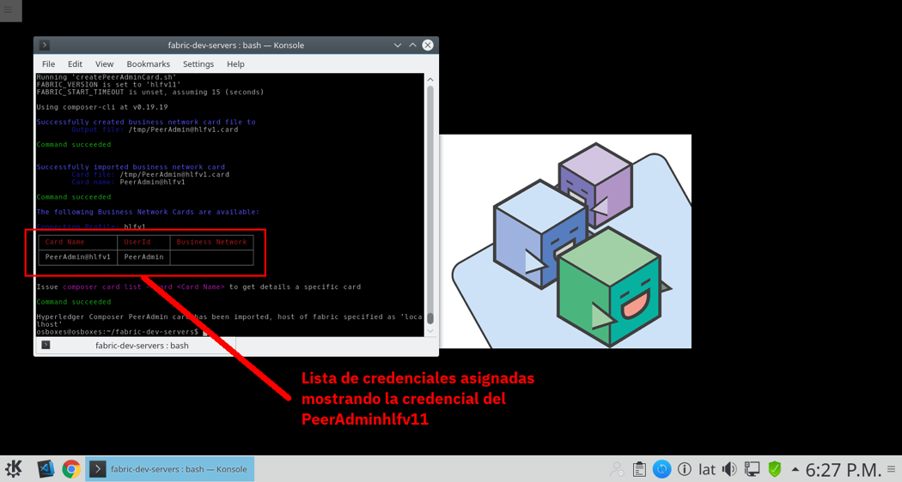

# Instrucciones para controlar Hyperledger Fabric
## Introducción
Siguiendo las siguientes instrucciones, se espera que el alumno pueda iniciar el ambiente de Blockchain proporcionado por Hyperledger Fabric, asignar cartas credenciales a su administrador, detener el ambiente, re iniciarlo e incluso destruirlo

## 1. Controlando el Blockchain
Dentro de la ventana de terminal debemos ejecutar el siguiente comando para cambiarnos al directorio donde se encuentra el ambiente de Blockchain

```
cd ~/fabric-dev-servers
```

Una vez que estamos ahí, le indicaremos al entorno que trabajaremos con la versión 1.1 del motor de Hyperledger Fabric con el siguiente comando

```
export FABRIC_VERSION=hlfv11
```

Finalmente, iniciamos el motor de Hyperledger Fabric mediante el siguiente comando

```
./startFabric.sh
```

Ahora debemos crear la carta credencial del administrador del Blockchain Hyperledger Fabric mediante el siguiente comando

```
./createPeerAdminCard.sh
```

Una vez ejecutado el comando, debemos ver en la pantalla un resultado similar al siguiente en donde se nos muestra una lista de tarjetas asociadas a nuestra instancia de Blockchain en donde debemos ver la tarjeta del administrador



## 2. Comandos Adicionales

De momento no ejecutaremos los siguientes comandos, pero los exponemos aquí por resultar útiles

### Detener la Instancia de Hyperledger Fabric
Para detener el motor, ejecutamos el siguiente comando

```
./stopFabric.sh
```

### Iniciar la Instancia
Para Volver a iniciar la instancia de Hyperledger Fabric, debemos ejecutar el siguiente comando
```
./startFabric.sh
```

### Borrar la Instancia
Para borrar totalmente una instancia de Hyperledger Fabric previamente creada, debemos ejecutar el siguiente comando
```
./teardownFabric.sh
```

Cabe hacer notar que luego de esto podemos volver a ejecutar el comando `./startFabric.sh` para iniciar, pero así mismo debemos volvel a ejecutar el comando `./createPeerAdminCard.sh` ya que al borrar la instancia se borran las cartas credenciales
