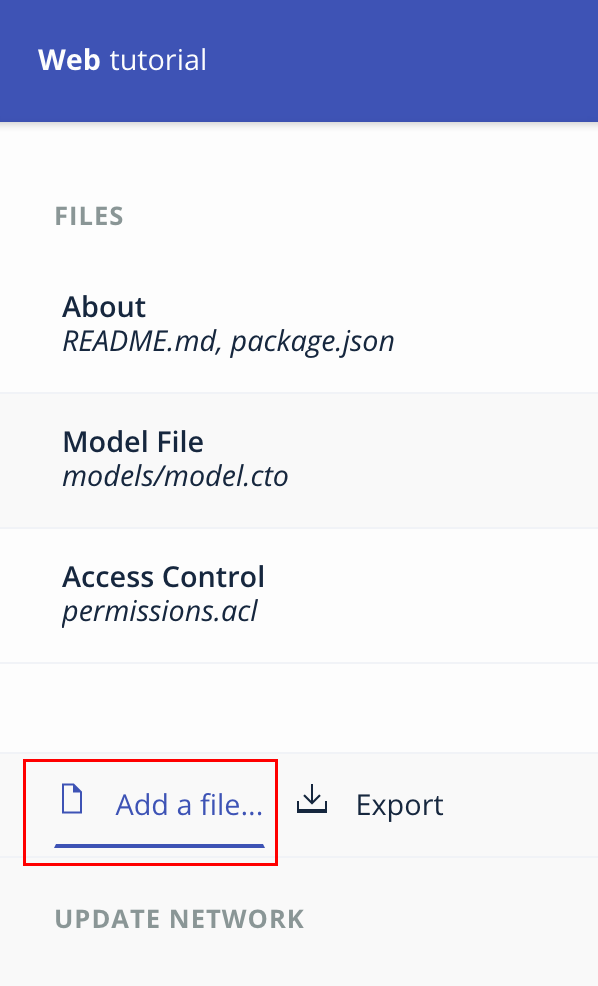
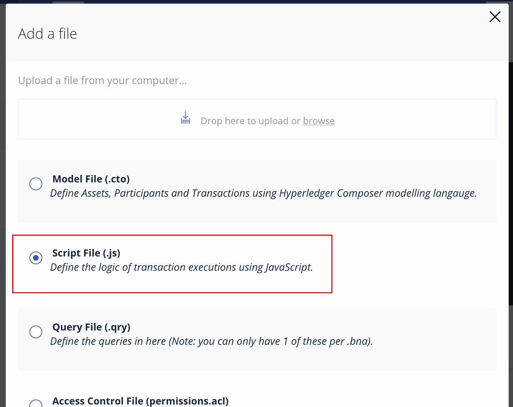

# Instrucciones para crear un contrato inteligente
## 1. Introducción
Siguiendo las siguientes instrucciones, se espera que el alumno pueda definir la lógica de negocio o contrato inteligente que gobernará las interacciones en una red de negocio

## 2. Agregando un Archivo para la Lógica de Negocio
En el menú del lado izquierdo, debemos seleccionar el boton inferior izquierdo para crear un nuevo archivo como se muestra a continuación



Luego de presionar el botón, se nos muestra un menú para definir el tipo de archivo a usar. Debemos seleccionar un archivo de __script__ como se muestra a continuación



## 3. Agregando la Lógica de Negocio
Dentro de este archivo deberemos registrar el siguiente código fuente en javascript, mismo que analizaremos a detalle

```javascript
'use strict';
/**
 * Lógica transaccional
 *
 * @author Baltazar Rodriguez Tellez <rtellez@mx1.ibm.com>
 */

/**
 * Operar una transaccion entre un comerciante y otro
 * @param {org.tutorial.mercancias.Opera} operacion - la operación a ser procesada
 * @transaction
 */
function operaMercancia(operacion) {
  var viejoDueño = operacion.mercancia.dueño;

  operacion.mercancia.dueño = operacion.nuevoDueño;

  return getAssetRegistry('org.tutorial.mercancias.Mercancia')
    .then(function (mercanciaRegistry) {
      return mercanciaRegistry.update(operacion.mercancia);
    })
    .then(function () {
      var eventoOperacion = getFactory().newEvent('org.tutorial.mercancias', 'EventoOperacion');

      eventoOperacion.mercancia = operacion.mercancia;
      eventoOperacion.viejoDueño = viejoDueño;
      emit(eventoOperacion);
    });
}
```

[__Regresar al Inicio__](README.md)