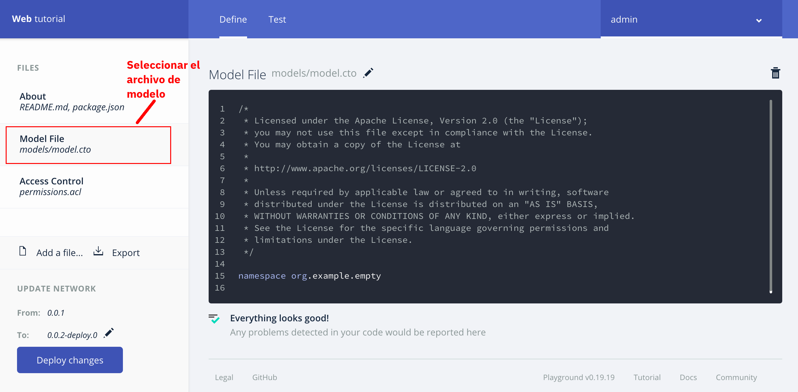

# Instrucciones para crear una red de negocio
## 1. Introducción
Siguiendo las siguientes instrucciones, se espera que el alumno pueda definir una red de negocio mediante la definición de participantes, la definición de activos y la definición de transacciones dentro de un contrato inteligente

## 2. Presentando el Modelo a Alto Nivel
Durante este ejercicio, crearemos una red de negocio para la compraventa de mercancías agropecuarias entre un grupo de comerciantes. El modelo iniciará de forma simple y luego se re definirá para agregar un poco mas de complejidad integrando a la red a los mercados que regulan la compraventa de las mercancías.

## 3. Iniciando la definición
Iniciamos seleccionando del menú del lado izquierdo, la sección marcada como __Model File__ como lo indica la siguiente imagen



Al hacerlo, el editor del lado derecho nos muestra un texto sugerido, mismo que deberemos borrar. En lugar de dicho texto deberemos escribir lo siguiente

```
/*
 * Modelo de red inicial para el tutorial de Hyperledger
 * Composer
 */

namespace org.tutorial.mercancias
```
De este texto destacan los siguientes elementos:
1. Todo aquello contenido entre los símbolos `/*` y `*/` son considerados comentarios. Los comentarios son documentación que ponemos intermezclada en nuestra programación para facilitar a nosotro y a otros lectores para que puedan entender lo que estamos haciendo
2. La sentencia que aparece a la derecha de la frase `namespace` corresponde al dominio dentro del cual definiremos los conceptos de nuestra red. Esto se hace para evitar conflictos entre dos dominios en distintos en donde existan conceptos con el mismo nombre pero con distinto significado. Podemos considerar el namespace como el _apellido_ que le otorgamos a un concepto para evitar homonimias

## 4. Definiendo a los Participantes
Como recordamos, las redes de negocio son formadas por participantes que interactuan entre si. Dentro de Composer, los participantes se definen con la palabra clave __participant__. A continuación definiremos a nuestro primer participante, el comerciante

```
participant Comerciante identified by comercianteId {
  o String comercianteId
  o String nombre
  o String apellido
}
```
Como regla general, todos los participantes deben tener un atributo que los identifique (en este caso comercianteId). Entre los corchetes vemos adicionalmente la definición de los atributos que constituyen el modelo de un comerciante. Normalmente, cada atributo tiene un tipo primitivo y un nombre

## 5. Los Tipos Primitivos
Composer reconoce los siguiente tipos primitivos:

- String: Una cadena de texto.
- Double: Un número de doble precisión
- Integer: Un número entero con signo de 32 bits
- Long: Un número entero con signo de 64 bits.
- DateTime: una estructura de hora y fecha en formato ISO-8601 que de manera optativa puede integrar desface horario y huso horario
- Boolean: un valor booleano que puede ser verdadero o falso

## 6. Definiendo Activos
Ahora debemos definir un activo a manejar en nuestra red de negocio. Dentro de Composer, los activos se definen con la palabra clave __asset__. A continuación definiremos a nuestro primer activo, la mercancia

```
asset Mercancia identified by mercanciaId {
  o String mercanciaId
  o String descripcion
  o Double cantidad
  --> Comerciante dueño
}
```
Como regla general, todos los activos deben tener un atributo que los identifique (en este caso mercanciaId). Entre los corchetes vemos adicionalmente la definición de los atributos que constituyen el modelo de un comerciante. Normalmente, cada atributo tiene un tipo primitivo y un nombre al igual que en el caso de los participantes.

Cabe notar, que en este caso estamos introduciendo un nuevo concepto, la referencia que se denota como un `-->` esto quiere decir que el atributo dueño es una referencia a un Comerciante. Esto no quiere decir que la información del comerciante que actua como dueño se encuentre almacenada aquí, sino que en realidad se trata tan solo de una referencia o apuntador

## 7. Definiendo Transacciones
Ahora debemos definir una transacción a ser operada dentro de nuestra red de negocios.  Dentro de Composer, las transacciones se definen con la palabra clave __transaction__. A continuación definiremos a nuestra primera transacción, Opera que corresponderá a una operación de compraventa

```
transaction Opera {
  --> Mercancia mercancia
  --> Comerciante nuevoDueño
}
```
Como podemos ver en esta definición __no__ especificamos la lógica que gobierna la transacción, solo la nombramos y definimos que parámetros serán utilizados para poder operar la transacción. En este caso nuestros parámetros serán una referencia a la mercancia que será vendida y una referencia al comerciante que comprará la mercancia

## 8. Definiendo Eventos
Las transacciones dentro de las redes de negocio pueden disparar eventos. Dentro de composer, los eventos se definen con la palabra clave __event__. A continuación definiremos nuestro primer evento, __EventoOperacion__ que como su nombre indica, sera disparado cada vez que se realize una operación

```
event EventoOperacion {
  --> Mercancia mercancia
  --> Comerciante viejoDueño
}
```
Como podemos ver, en este caso se especifican los parámetros que constituyen el evento. En este caso, nuestro evento tiene una referencia a la mercacía vendida y una referencia al comerciante que vendió dicha mercancía. Al igual que en el caso de la transacción, no definimos lógica, tan solo se define el modelo o estructura

[__Regresar al Inicio__](README.md)