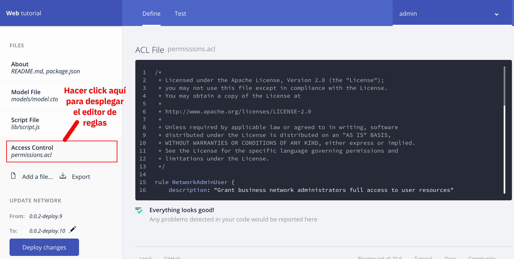

# Instrucciones para la Creación de Reglas de Acceso
## Introducción
Siguiendo las siguientes instrucciones, se espera que el alumno pueda actualizar las reglas de acceso del Blockchain con lo que aprenderá a autorizar o denegar el acceso a transacciones y recursos a perfiles específicos

## 1. Accediendo al Editor de Reglas
Para iniciar la edición de reglas, debemos asegurarnos que estamos dentro de la opción de definición de la red de negocio como se muestra a continuación:



Una vez en la sección de definición, debemos hacer click dentro del menú de la izquierda sobre la opción marcada como __Access Control__ como se muestra a continuación:


Una vez seleccionada la opción, borraremos el texto que aparece dentro del editor para iniciar con la creación de nuestras reglas

## 2. Entendiendo la Operación de las Reglas
Las reglas dentro de __Hyperledger Composer__ son las que determinan si un participante tiene o no acceso a realizar una acción sobre un recurso administrado por la red. En general los recursos pueden ser activos, participantes, transacciones o eventos ademas de acceso a la red misma.

Mas allá de autorizar o denegar el acceso a un recurso, este se puede limitar a un tipo particiular de acceso por ejemplo __CREATE__ (creación), __READ__ (lectura), __UPDATE__ (modificación), __DELETE__ (eliminación) o bien __ALL__ (la conjunción de todos los permisos anteriores). 

En general podemos decir que existen dos tipos de reglas dentro de __Hyperledger Coposer__; Las reglas simples y las reglas condicionales. Estas se explican a continuación.

### 2.1 Reglas Simples
Las reglas simples establecen de forma directa el acceso que tiene un participante a un recurso. Por ejemplo, analicemos la siguiente regla:

```
rule ReglaSimple {
    description: "Descripción de la regla"
    participant: "org.ejemplo.Participante"
    operation: ALL
    resource: "org.ejemplo.Activo"
    action: ALLOW
}
```
Esta regla, llamada `ReglaSimple` le otorga todos los permisos al participante `org.ejemplo.Participante` sobre el recurso llamado `org.ejemplo.Activo`. Podemos decir esto pues el valor de __operation__ es __ALL__ y el valor de __action__ es __ALLOW__. 

Asumamos por un momento que quisieramos negar totalmente el acceso al recurso para el participante, entonce la regla sería modificada para mostrar algo así:

```
rule ReglaSimple {
    description: "Descripción de la regla"
    participant: "org.ejemplo.Participante"
    operation: ALL
    resource: "org.ejemplo.Activo"
    action: DENY
}
```
Esto denegaría la totalidad de las operaciones pues el valor de __action__ es __DENY__.

Asumamos ahora que mas bién lo que queremos es permitir que el participante pueda únicamente leer y actualizar el valor del activo, entonces nuestra regla quedaría como:

```
rule ReglaCondicionada {
    description: "Descripción de la regla"
    participant: "org.ejemplo.Participante"
    operation: READ,UPDATE
    resource: "org.ejemplo.Activo"
    action: ALLOW
}
```
### 2.2 Reglas Condicionales
Las reglas condicionales son un tipo de regla mas poderosa pues introduce el concepto de variables que pueden ser usadas en la evaluación de una condición que gobierna la aplicación de la regla de acceso. Esto es, dependiendo de si la condición evalúa como verdadera o falsa, se aplicaría o no el valor de __action__, condicionando así el __ALLOW__ o __DENY__ a una condición lógica. Veamos un ejemplo:

```
rule ReglaCondicional {
    description: "Descripción de la regla"
    participant(p): "org.ejemplo.Participante"
    operation: ALL
    resource(r): "org.ejemplo.Activo"
    condition: (r.dueño.getIdentifier() == p.getIdentifier())
    action: ALLOW
}
```
Esta regla, llamada `ReglaCondicional` le otorga todos los permisos al participante `org.ejemplo.Participante` sobre el recurso llamado `org.ejemplo.Activo`. Sin embargo, en este caso estamos agregando un par de elementos importantes. Por una parte, estamos definiendo dos variables, la variable `p` que tomará el valor del `org.ejemplo.Participante` que se está evaluando y la variable `r` que tomará el valor del recurso `org.ejemplo.Activo`. Finalmente, establecemos una condición, `(r.dueño.getIdentifier() == p.getIdentifier())` en donde evaluamos si el dueño del activo `r.dueño.getIdentifier()` es el participante `p.getIdentifier()` mismo que está intentando tener acceso al recurso. En el caso de que la evaluación resulte cierta, se aplicará la acción (__action__) que en este caso es __ALLOW__. Entendemos entonces, que si el participante que busca acceder al recurso es el mismo que está registrado como dueño, entonces dicho participante tendra acceso a todas las operaciones y en caso contraro será denegado.

De forma adicional, las reglas condicionales pueden asociarse a una transacción. Esto resulta sumamente util pues podemos adicionalmente, limitar el acceso a un recurso mediante el uso de una transacción. La implicación de esto es sutil pero importante ya que hasta ahora, el acceso se limita a un recurso pero no tenemos control adicional sobre el acceso y este se otorga o se niega totalmente. Pensemos por ejemplo que queremos un control mas fino sobre un recurso en donde queremos por ejemplo limitar los cambios a un atributo del recurso o aplicar validaciones lógicas al cambio ejecutado, en ese caso podemos condicionar adicionalmente a que el acceso se haga mediante una transacción y sería dicha transacción la encargada de aplicar las validaciones y limitaciones adicionales como parte del __Contrato Inteligente__. 

Supongamos que tenemos el mismo ejemplo presentado como muestra de la __Regla Condicional__, en donde se le otorgarán todos los permisos sobre el activo a un participante mientras este sea el dueño del activo, pero ahora adicionalmente, limitaremos el acceso a dicho activo a que sea mediante la ejecución de una transacción llamada `org.ejemplo.TransaccionEjemplo` como se muestra a continuación

```
rule ReglaCondicionalTransaccional {
    description: "Descripción de la regla"
    participant(p): "org.ejemplo.Participante"
    operation: ALL
    resource(r): "org.ejemplo.Activo"
    transaction(tx): "org.ejemplo.TransaccionEjemplo"
    condition: (r.dueño.getIdentifier() == p.getIdentifier())
    action: ALLOW
}
```

## 2.3 Notas Adicionales

### 2.3.1 Reglas por Clase vs Reglas Específicas

Hasta ahora hemos visto reglas definidas por clase, esto es, nuestras reglas aplican a una clase de participante o a una clase de recurso. Por ejemplo, si nuestra regla está definida con una clausula como la siguiente:

`participant: "org.ejemplo.Participante"`

Quiere decir que aplicará a cualquier participante del tipo `org.ejemplo.Participante`. Existe la posibilidad de hacer que esta regla sea mas específica y que aplique únicamente a un participante en concreto. Por ejemplo, asumamos que uno de estos participantes está identificado por la clave `participante1` y que queremos que nuestra regla únicamente aplique a el, entonces la cláusula de participante sería la siguiente:

`participant: "org.ejemplo.Participante#participante1"`

Como podemos ver, la diferencia entre ambas consisten en que agregamos al final `#participante1` lo que hace que la regla únicamente le aplique a dicho participante en específico.

Esta misma lógica, aplica para los recursos por lo que si quisieramos, continuando con nuestro ejemplo, crear una regla que únicamente aplicara sobre el recurso `activo1` la definiríamos de la siguiente forma:

`resource: "org.ejemplo.Activo#activo1"`

[__Regresar al Inicio__](README.md)